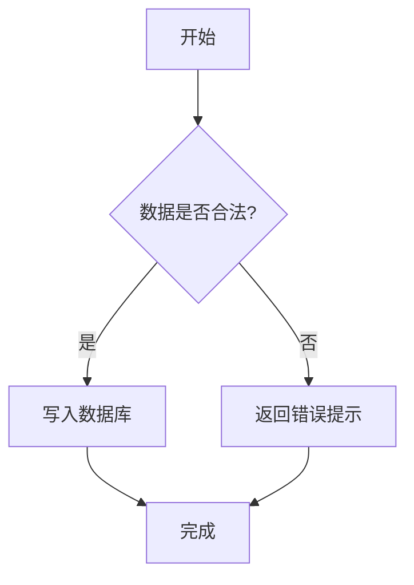
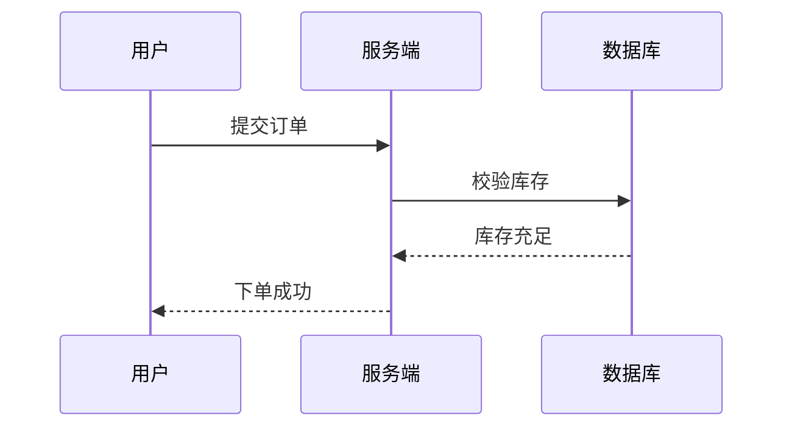

# L2 功能验证示例

[TOC]

> 使用方法：新建空白文档 → 把本文内容全部复制粘贴进编辑器 → 切到「分屏」模式，
> 右侧预览会实时渲染。逐项核对下方清单。

---

## 一、KaTeX 数学公式（$$ 块级 / $ 行内）

块级公式（空行输入 `$$` 后回车，或工具栏 `Σ` 按钮）：

$$
\int_{-\infty}^{+\infty} e^{-x^2}\,dx = \sqrt{\pi}
$$

行内公式（工具栏 `𝑥` 按钮，或双击已有公式编辑）：

质能方程 $E = mc^2$ 是现代物理的基石，配上方盒归一条件 $\sum_{i=1}^{n} x_i^2 = 1$。

多行对齐公式：

$$
\begin{aligned}
\nabla \cdot \mathbf{E} &= \frac{\rho}{\varepsilon_0} \\
\nabla \times \mathbf{B} &= \mu_0\mathbf{J} + \mu_0\varepsilon_0\frac{\partial \mathbf{E}}{\partial t}
\end{aligned}
$$

**验证点**：
- [ ] 块级公式居中、清晰渲染，单击公式进入源码编辑，Ctrl+Enter 提交
- [ ] 行内公式不撑高行距、与正文齐平
- [ ] 双击行内公式弹窗可改 LaTeX 源码

---

## 二、Mermaid 图表（```mermaid 围栏）

流程图：



时序图：



甘特图：


**验证点**：
- [ ] 三种图都实时渲染成图形，深色/浅色主题切换后配色跟随
- [ ] 导出 HTML / PDF 后图表仍在（打开导出文件自动渲染）

---

## 三、脚注（[^1] 引用 + [^1]: 定义）

Typora 的作者曾经说过[^1]，Markdown 的优雅在于"所见即所得"[^note2]。

**验证点**：
- [ ] 正文出现上标 [1] / [note2] 蓝色链接
- [ ] 文档中定义位置显示灰色脚注块（左边框）
- [ ] 重新粘贴回源码，脚注语法不丢失

[^1]: 这是第一个脚注，用于说明引用来源。
[^note2]: 第二个脚注支持多行内容
    续行会自动折叠为单行。

---

## 四、标题锚点 / 内部链接

点击下方链接，预览区应平滑滚动到对应标题：

- [跳转到「KaTeX 数学公式」](#一-katex-数学公式-块级-行内)
- [跳转到「Mermaid 图表」](#二-mermaid-图表-mermaid-围栏)
- [跳转到「脚注」](#三-脚注-1-引用-1-定义)
- [回到文档开头](#l2-功能验证示例)

**验证点**：
- [ ] 点击链接平滑滚动到对应标题，且不触发页面跳转
- [ ] TOC 目录里的条目同样可点击跳转

> 提示：锚点 = 标题原文去掉空格/标点、转小写、空白用连字符（如
> 「一、KaTeX 数学公式」→ `#一-katex-数学公式-…`），写法：`[文字](#标题锚点)`。

---

## 五、代码块（Typora 风格）+ 快捷键

```python
def fib(n):
    """生成斐波那契数列"""
    a, b = 0, 1
    for _ in range(n):
        yield a
        a, b = b, a + b

print(list(fib(10)))  # [0, 1, 1, 2, 3, 5, 8, 13, 21, 34]
```

**验证点**：
- [ ] 在代码区任意位置点击即可输入，光标与高亮字形对齐
- [ ] 点右下角语言标签弹出搜索框换语言（如换成 javascript）
- [ ] 空代码块按 Backspace 整块删除；Ctrl+Enter 跳出代码块继续写正文
- [ ] 在空行输入 ``` 后回车，直接生成代码块

---

## 六、快捷键总览（L1+L2）

| 快捷键 | 功能 |
|---|---|
| Ctrl+S | 手动保存（首次选路径，之后静默写回） |
| Ctrl+Z / Ctrl+Y | 撤销 / 重做 |
| Ctrl+F | 查找 / 替换（工具栏已不放按钮，此快捷键打开） |
| Ctrl+1..6 / Ctrl+0 | 一级~六级标题 / 正文 |
| Ctrl+B / Ctrl+I / Ctrl+K | 加粗 / 斜体 / 插入链接 |
| Ctrl+Shift+V | 粘贴为纯文本 |
| Ctrl+` | 行内代码 |
| Ctrl+N | 新建文档 |

---

## 七、图片归档（保存时自动执行）

1. 在文档中粘贴一张图片（Ctrl+V 或工具栏 🖼），图片以 base64 存在文档里
2. 按 Ctrl+S 保存为 `test.md`
3. 打开保存目录，应看到 `assets/img-01.png` 图片文件，`test.md` 里的图片引用变为相对路径 ``
4. 把整个文件夹拷贝到别处，图片依然正常显示（相对路径不失效）

**验证点**：
- [ ] 保存后出现 assets/ 目录与图片文件
- [ ] 状态栏提示「N 张图片已归档到 assets/」
